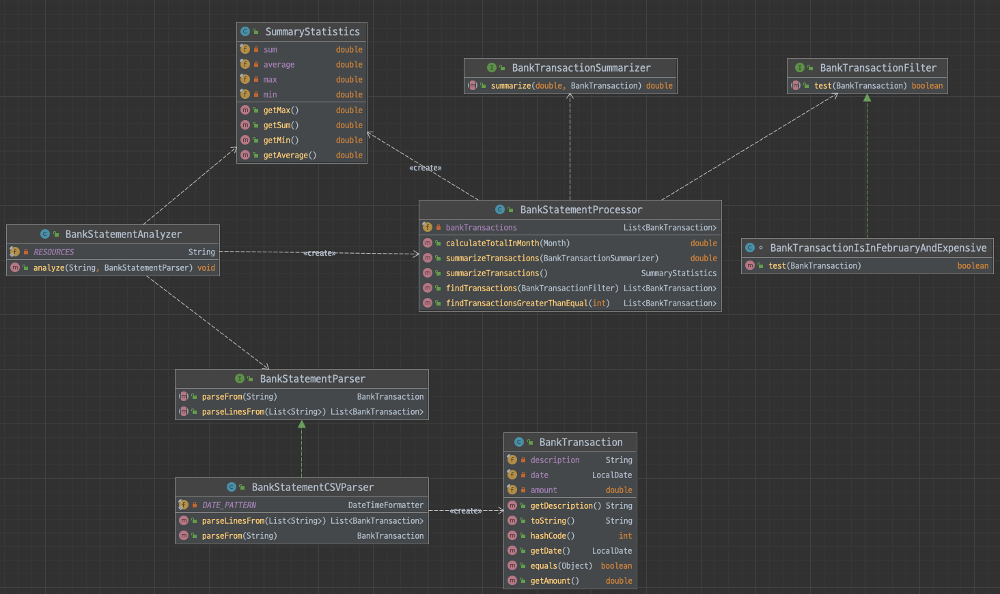

# 3장 입출금 내역 분석기 확장판

> 구현 요구사항

- 다양한 입출금 내역 분석
- 여러 포맷을 지원 및 처리
- 텍스트, HTML 형식으로 리포트

> 학습 목표

- 유지보수성을 높일 수 있는 OCP에 대한 학습
- 인터페이스에 대한 가이드라인과 높은 결합도를 피할 수 있는 방법

> 정리

- OCP 원칙을 이용하면 코드를 바꾸지 않고도 메서드나 클래스의 동작을 바꿀 수 있다.